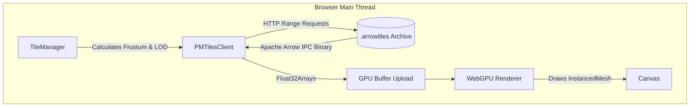

# Deepgraph WebGPU: ArrowTiles Sandbox 🚀

This repository is an experimental sandbox and stress test for the WebGPU-based successor to the Deepgraph static embedding engine. 

The specific goal of this sandbox was initially to push the boundaries of browser-based rendering by visualizing the **European Space Agency's (ESA) Gaia dataset**—an astronomical catalogue mapping over a billion stars.

However, the architecture has evolved into a **Massive Declarative Scatter Plot Engine**. While Gaia remains our primary billion-row stress test for out-of-core streaming and Additive Blending LOD, the engine is now fully generic and capable of rendering any massive tabular dataset natively in the browser.

This repository focuses purely on the **client-side WebGPU rendering**. The data generation pipeline that builds the `.arrowtiles` archives is housed in our sibling repository, `duckdb-arrowtiles`.

## 🛠️ Getting Started

### Prerequisites
- Node.js (v18+)
- A modern browser with **WebGPU enabled** (Chrome 113+, Edge 113+, Firefox Nightly, or Safari 18+).

### Setup

```bash
# Clone the repository
git clone https://github.com/kai-erlenbusch/deepgraph-arrowtiles-sandbox.git
cd deepgraph-arrowtiles-sandbox

# Install dependencies
npm install

# Start the development server
npm run dev
```

The application will launch on `http://localhost:5173`.

---

## 🏗️ Frontend Architecture

The system operates on a multi-threaded pipeline designed to minimize CPU bottlenecks during rendering and maximize data throughput over HTTP.



1. **`main.ts`**: Initializes the WebGPU scene and handles the `InstancedMesh`.
2. **`TileManager.ts`**: Handles spatial Quadtree indexing and limits HTTP connection flooding via dynamic `overfetch` tuning.
3. **`PMTilesClient.ts`**: Issues HTTP Range Requests to the unified `.arrowtiles` archive. It uses a dynamic Web Worker pool (`pmtiles.worker.ts`) to offload Zstandard WebAssembly decompression (`@bokuweb/zstd-wasm`) and Apache Arrow IPC parsing, ensuring the Main UI thread remains unblocked before passing zero-copy `Float32Array` buffers to the GPU.

### 🔗 Sibling Projects

This repository is strictly the frontend viewer. The heavy lifting of sorting the 1.8 billion row dataset and packing it into an `.arrowtiles` archive is done by the backend repository:

- **[duckdb-arrowtiles](https://github.com/kai-erlenbusch/duckdb-arrowtiles)**: A high-performance Python and Rust IPC pipeline that utilizes DuckDB for out-of-core spatial sorting and Rayon for parallel Zstd compression.

---

## 🔍 Deep Dive: WebGPU Instanced Rendering & Density Culling

Traditional WebGL engines struggle to render millions of distinct geometries because the CPU cannot push that many individual `draw` calls without bottlenecking. 

This engine bypasses the CPU overhead using **WebGPU Instanced Rendering**.

Instead of telling the GPU to draw millions of distinct dots, we instruct the GPU to draw **1 generic quad/circle**, but to draw it millions of times simultaneously.

### Global Magnitude Culling (LOD)
To prevent extreme additive blowouts and preserve 60 FPS when looking at the dense Galactic Equator, we implemented **Global Magnitude Culling**:
1. In the pipeline, every star is sorted globally by absolute magnitude (`abs_m ASC`) and packed into the tiles in strictly sorted order.
2. In the WebGPU Node Material, we pass a dynamic `maxMagUniform` that scales based on the camera zoom.
3. At low zoom levels (Zoom 0), the shader physically discards stars fainter than Magnitude 14. 
4. Because the cutoff is based on a global physical property (magnitude) rather than a local row index or arbitrary tile limit, it perfectly preserves the natural density gradient of the galaxy without causing artificial tile seams or boundaries. As you zoom in, the threshold relaxes, revealing the faint background stars.

---

## 🚀 Recent Architectural Evolutions

1. **`.arrowtiles` vs `.pmtiles`:** By packing the Apache Arrow chunks into a single PMTiles-compatible archive using our backend pipeline, we leverage HTTP Range Requests. This reduces network overhead, avoids S3 file-count limits, and natively supports columnar data via Arrow IPC.
2. **Wasm Zstd Decompression:** We migrated from pure JS decompression (`fzstd`) to a WebAssembly-native library (`@bokuweb/zstd-wasm`). This provides massive CPU savings when streaming heavy tiles.
3. **Arrow IPC Schema Stripping:** To minimize PMTiles metadata bloat, the Arrow IPC schema header (~1KB per tile) is stripped from every chunk by the backend. `PMTilesClient.ts` asynchronously decodes this schema from the global metadata block and dynamically prepends it to chunks via the Web Worker, preserving zero-copy compatibility while shrinking the total archive size by ~12%.
4. **Corrected Galactic Projection & Orientation:** Implemented accurate Equatorial-to-Galactic coordinate transformations in the data pipeline to prevent the dense Milky Way core from being distorted or smeared across spatial chunk boundaries. Additionally, applied WebGPU inverted-Y rendering fixes to ensure the final visual projection matches standard astronomical orientations.
5. **Code Quality & Memory Stability Improvements:**
   - **Type Safety:** Hard-locked Three.js versions and isolated WebGPU fast-path queue writes behind a brittle-safe `WebGPUAdapter`.
   - **Memory Leak Resolution:** Implemented zero-allocation recycling for Zstd payload ArrayBuffers during request aborts to prevent iOS Safari memory crashes.
   - **Worker Pool Optimization:** Swapped round-robin worker selection for an Idle-Queue worker pool that actively sheds stale tasks to avoid CPU locking during rapid zooming.
   - **Quadtree Thrashing:** Refactored LOD tile culling to use a weighted heuristic (`DistanceToCenter + Z_Level * DepthPenalty`) ensuring viewport centers load gracefully under extreme network strain.
   - **TSL Modularization:** Extracted sprawling closure-based shader structures into explicit, standalone `fn()` abstractions to prevent WebGPU AST binding failures.
6. **Zoom-Linked Dynamic Cluster Boosting:** Replaced arbitrary max-tile budgeting with a geometrically accurate mapping between the camera frustum and Quadtree Z-levels. Additionally, the WebGPU shader selectively isolates **faint cluster stars** and applies an `easeOut` curve as the camera zooms into them.
7. **Multi-Threaded Decompression Pool:** Because Zstandard decompression is extremely CPU-heavy, decompressing 100+ dense tiles simultaneously caused the main browser thread to lock up. We implemented a dynamic Round-Robin Web Worker pool scaled to `navigator.hardwareConcurrency`. PMTiles decompression and Apache Arrow IPC parsing are now entirely off-main-thread, restoring 60 FPS UI interactivity even during massive network fetches.
8. **Declarative Render Graph & Dynamic TSL:** The `Scatterplot.ts` WebGPU engine now uses Three.js Node Materials (TSL) to dynamically compile the rendering shader based on a JSON config (e.g., swapping between Viridis, RdBu, and mapping specific scales).
9. **Dynamic Web Worker Allocation:** The Web Worker pool no longer hardcodes column names. It accepts a dynamic `requestedColumns` array and returns exactly what the shader needs, drastically reducing memory waste on the CPU.
10. **Zero-Allocation WebGPU Pipeline:** We completely eliminated JavaScript Garbage Collection pauses and VRAM allocation spikes during high-speed map panning:
   - **Dimension-Safe Buffer Pooling:** The PMTiles client uses a `Map<string, ArrayBuffer[]>` to recycle memory by column name inside the Web Worker.
   - **Direct VRAM Queue Writing:** The engine bypasses Three.js attribute reallocation and uses `device.queue.writeBuffer()` to blast worker payloads directly into pre-allocated GPU memory. This ensures the 16-attribute WebGPU limit is respected and prevents VRAM exhaustion.
10. **Dual Rendering Modes:** The UI natively supports both **"Chart Mode"** (a fully generic visualizer for any X/Y/Color/Size tabular data) and the **"Gaia Baseline"** (our golden standard astronomy shader with custom mathematical zoom-fading).

---

## 🚧 Known Challenges & Current Limitations

This is a stress test sandbox, and several major architectural challenges remain unresolved:

- **GPU VRAM Spikes:** When panning rapidly, the quadtree traversal can fetch dozens of tiles simultaneously. While we've aggressively tuned `overfetch` to prevent network connection starvation, the engine dynamically creates new WebGPU `InstancedBufferAttributes` when loading these tiles, which can trigger VRAM exhaustion or command queue stalls on lower-end devices.
- **Initial Payload Size:** The generated `gaia.arrowtiles` archive is ~15.8 GB, which is optimal for Range Requests, but necessitates hosting the archive on a CDN or cloud storage bucket capable of handling sustained byte-range queries efficiently.

## 🗺️ Future Roadmap
While the core pipeline successfully processes billion-row datasets, there are several major architectural leaps planned to transform ArrowTiles from a sandbox tool into a world-class spatial ecosystem.

**Phase 1: Pipeline & Frontend Optimization**
* Z-Level Partitioning (Zero-Wait Packing)
* Native C++ Web Worker Integration

**Phase 2: Core Enhancements**
* Spatial Tile Bounds Metadata 

## 📜 Citing

If you use this software in your work or scientific research, it is important to properly cite it to acknowledge the contribution of the developers. When citing, please include the following metadata:

[Insert Names/Title/Year] [Computer software]. https://github.com/kai-erlenbusch/deepgraph-arrowtiles-sandbox

This citation should include the names of the developers, the year of publication, the title of the software, and the medium (Computer software). The URL should also be included to provide a direct link to the software.

## 📄 Licensing

This project is freely available for non-commercial use under the **Creative Commons Attribution Non Commercial CC BY-NC 4.0** public license. Please note that this license does not permit commercial use of the software. For more information about the limitations of this license, you can refer to the [CC BY-NC 4.0 License Deed](https://creativecommons.org/licenses/by-nc/4.0/).

If you’re planning to use this software commercially, please reach out to us for a Business license.
