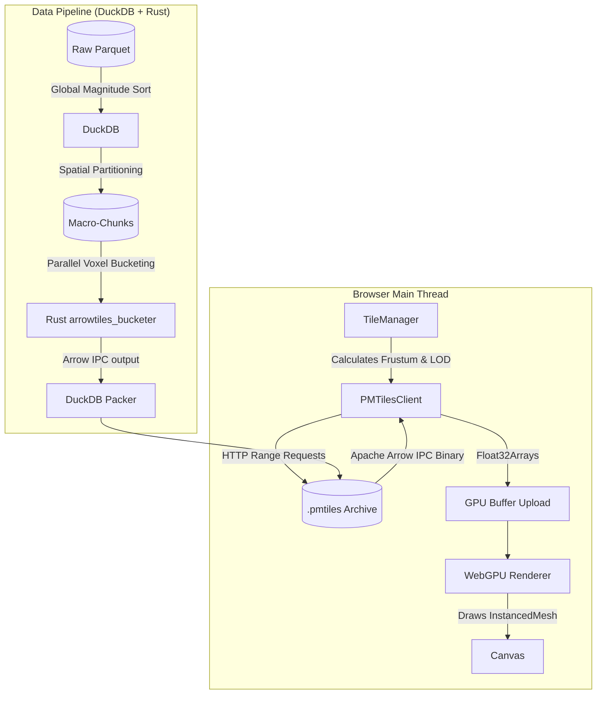

# Deepgraph WebGPU: ArrowTiles Sandbox 🌌

This repository is an experimental sandbox and stress test for the WebGPU-based successor to the Deepgraph static embedding engine. 

The specific goal of this sandbox is to push the boundaries of browser-based rendering by visualizing the **European Space Agency's (ESA) Gaia dataset**—an astronomical catalogue mapping the positions and movements of over a billion stars in the Milky Way galaxy.

Because the Gaia dataset is incredibly dense and massive, it serves as the ultimate stress test for out-of-core data streaming, GPU memory management, and Additive Blending LOD (Level-Of-Detail) algorithms.

This repository builds upon our previous `deepgraph-webgpu-sandbox`, but fundamentally replaces the backend. Instead of streaming thousands of individual `.feather` files from an S3 bucket, this architecture uses a hybrid **DuckDB + Rust** pipeline to pack the entire quadtree into a single, highly-optimized **PMTiles** archive containing Apache Arrow IPC chunks.

## 🚀 Getting Started

### Prerequisites
- Node.js (v18+)
- A modern browser with **WebGPU enabled** (Chrome 113+, Edge 113+, Firefox Nightly, or Safari 18+).
- Python 3.10+ and Rust (for the data generation pipeline)
- DuckDB with the custom `arrowtiles` extension.

### Setup

```bash
# Clone the repository
git clone https://github.com/kai-erlenbusch/deepgraph-arrowtiles-sandbox.git
cd deepgraph-arrowtiles-sandbox

# Install dependencies
npm install

# Start the development server
npm run dev
```

The application will launch on `http://localhost:5173`.

---

## 🏗️ Architecture Overview

The system operates on a multi-threaded pipeline designed to minimize CPU bottlenecks during rendering and maximize data throughput over HTTP.



1. **`main.ts`**: Initializes the WebGPU scene and handles the `InstancedMesh`.
2. **`TileManager.ts`**: Handles spatial Quadtree indexing and limits HTTP connection flooding via dynamic `overfetch` tuning.
3. **`PMTilesClient.ts`**: Replaces the old Web Worker. It issues HTTP Range Requests to the unified `.pmtiles` archive, extracts the Apache Arrow IPC binary chunks, and parses them into zero-copy `Float32Array` buffers.
4. **`generate_pipeline.py` & `arrowtiles_bucketer`**: A hybrid Python/DuckDB/Rust pipeline that ingests raw Parquet datasets, projects them geometrically using a Hammer projection, sorts them globally by magnitude (brightness), and efficiently packs them into quadtree LOD levels using a multi-threaded Rust spatial voxel bucketer.

### 📁 Repository Structure

```text
deepgraph-arrowtiles-sandbox/
├── src/                          # Frontend WebGPU Application
│   ├── core/                     # WebGPU Renderer initialization & HDR tone mapping
│   ├── main.ts                   # Main application loop and UI telemetry
│   ├── PMTilesClient.ts          # Range Requests, Arrow IPC parsing, LRU Cache
│   ├── pmtiles.worker.ts         # Web Worker for non-blocking Arrow deserialization
│   └── Scatterplot.ts            # TSL Node Material, Quadtree meshes, Zero-Copy buffers
├── duckdb-arrowtiles/            # Rust / DuckDB Backend Pipeline 
│   ├── src/                      # Rust source code for the Bucketer and Packer
│   └── Cargo.toml                # Rust dependencies
├── utils/                        # Frontend Helpers (Arrow.ts, PMTiles.ts)
├── tests/                        # Vitest unit tests for quadtree spatial logic
├── legacy_pipeline/              # Old Python/Parquet pipeline scripts for reference
└── generate_pipeline.py          # Master script coordinating DuckDB & Rust data packing
```

---

## 🏎️ Deep Dive: WebGPU Instanced Rendering & Density Culling

Traditional WebGL engines struggle to render millions of distinct geometries because the CPU cannot push that many individual `draw` calls without bottlenecking. 

This engine bypasses the CPU overhead using **WebGPU Instanced Rendering**.

Instead of telling the GPU to draw millions of distinct dots, we instruct the GPU to draw **1 generic quad/circle**, but to draw it millions of times simultaneously.

### Global Magnitude Culling (LOD)
To prevent extreme additive blowouts and preserve 60 FPS when looking at the dense Galactic Equator, we implemented **Global Magnitude Culling**:
1. In the pipeline, every star is sorted globally by absolute magnitude (`abs_m ASC`) and packed into the tiles in strictly sorted order.
2. In the WebGPU Node Material, we pass a dynamic `maxMagUniform` that scales based on the camera zoom.
3. At low zoom levels (Zoom 0), the shader physically discards stars fainter than Magnitude 14. 
4. Because the cutoff is based on a global physical property (magnitude) rather than a local row index or arbitrary tile limit, it perfectly preserves the natural density gradient of the galaxy without causing artificial tile seams or boundaries. As you zoom in, the threshold relaxes, revealing the faint background stars.

---

## ✨ Recent Architectural Evolutions

1. **PMTiles Archive vs. Feather S3:** We moved away from thousands of individual `.feather` files. By packing the Apache Arrow chunks into a single `.pmtiles` file using DuckDB, we leverage HTTP Range Requests. This reduces network overhead, avoids S3 file-count limits, and massively simplifies deployment.
2. **Rust-Powered Pipeline:** The voxel bucketing step (Stage 2) was rewritten from Python into a parallelized Rust tool (`arrowtiles_bucketer`), solving memory constraints and accelerating processing times for the 24.5 GB raw dataset.
3. **Sub-Pixel Additive Tuning:** Base opacities have been dropped as low as `0.005` to simulate Deepscatter's extremely faint rendering logic, producing smooth, photorealistic Milky Way structure.

---

## ⚠️ Known Challenges & Current Limitations

This is a stress test sandbox, and several major architectural challenges remain unresolved:

- **GPU VRAM Spikes:** When panning rapidly, the quadtree traversal can fetch dozens of tiles simultaneously. While we've aggressively tuned `overfetch` to prevent network connection starvation, the engine dynamically creates new WebGPU `InstancedBufferAttributes` when loading these tiles, which can trigger VRAM exhaustion or command queue stalls on lower-end devices.
- **Initial Payload Size:** The generated `gaia.pmtiles` archive is ~18 GB, which is optimal for Range Requests, but necessitates hosting the archive on a CDN or cloud storage bucket capable of handling sustained byte-range queries efficiently.

## 📚 Citing

If you use this software in your work or scientific research, it is important to properly cite it to acknowledge the contribution of the developers. When citing, please include the following metadata:

[Insert Names/Title/Year] [Computer software]. https://github.com/kai-erlenbusch/deepgraph-arrowtiles-sandbox

This citation should include the names of the developers, the year of publication, the title of the software, and the medium (Computer software). The URL should also be included to provide a direct link to the software.

## 📄 Licensing

This project is freely available for non-commercial use under the **Creative Commons Attribution Non Commercial CC BY-NC 4.0** public license. Please note that this license does not permit commercial use of the software. For more information about the limitations of this license, you can refer to the [CC BY-NC 4.0 License Deed](https://creativecommons.org/licenses/by-nc/4.0/).

If you’re planning to use this software commercially, please reach out to us for a Business license.
